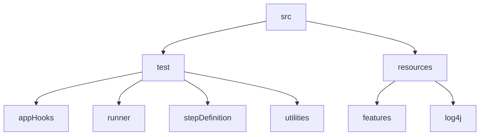

# LMSAPIAutomationProject
API Automation Project with Rest assured
## Table of contents
* [General info](#general-info)
* [Tools and Technologies](#tools-and-technologies)
* [FrameWork](#framework)
* [Running Project](#running-project)
* [Reporting](#reporting)


## General info
* Program API

  The user (Admin) can create different programs. The details are inserted in LMS DB (tbl_lms_program).
  The user can retrieve all programs and specific program based on Program ID.
  The user can update a program Details based on program ID and Program Name.
  The user can delete a program based on program ID and Program Name.

* Batch API

  The user can create a batch only if the program is present. As the batch is associated with program Id.
  The details are inserted in LMS DB(tbl_lms_batch).
  The user can retrieve all batches and specific Batch based on Batch Id, Batch Name, and Program ID
(tbl_lms_program).
  The user can update a Batch based on Batch ID.

## Tools and Technologies
Project is created with:
* Maven - Dependency management
* Java
* Rest Assured
* Cucumber with TestNG - BDD approach
* log4j - Logging
* Allure-testng - Reporting
* Extent Report (Spark and PDF)

## Framework

## Running Project
To run this project, 
Open terminal (MAC OS) or command prompt / power shell (for windows OS) and navigate to the project directory type mvn clean test command to run features
```
$ cd <Project Directory>

$ mvn clean test
```
Features will run in order :
1. SC_1a_Program_POST.feature
2. SC_1b_Program_PUT_ByName.feature
3. SC_1c_Program_PUT_ByID.feature
4. SC_1d_Program_GET_AllPrograms.feature
5. SC_1e_Program_GET_BYID-Extra.feature
6. SC_2a_Batch_POST.feature
7. SC_2b_Batch_PUT_ByName.feature
8. SC_2c_Batch_PUT_ByID-Extra.feature
9. SC_2d_Batch_GET_AllBatches-Extra.feature
10. SC_2e_Batch_GET_ById.feature
11. SC_2f_Batch_GET_ByProgramID-Extra.feature
12. SC_2g_Batch_Delete_BatchByID-Extra.feature
13. SC_2h_Batch_Delete_BatchByName-Extra.feature
14. SC_2i_Program_Delete_ByProgramId-Extra.feature
15. SC_2j_Program_Delete_ByProgramname-Extra.feature


Running with tags
```
$ cd <Project Directory>

$ mvn test -Dcucumber.filter.tags="@program"
```
## Reporting

Once tests complete run reports are generated. This framework uses different types of test reporters to communicate pass/failure.

Allure Report: 

Report will be generated into temp folder. Web server with results will start appearing in your default browser. 

```
$ cd <Project Directory>

$ allure serve allure-results
```
Extent Report (Spark and PDF):
Report will be generated tо directory: 
ExtentReports -> SparkReport_report created date time -> PDFReport & SparkReport 

HTML Report: 

Report will be generated tо directory: target/dsAlgoReport.html


### Develop automation scripts using BDD approach - Cucumber-Java :

Tests are written in the Cucumber framework using the Gherkin Syntax. More about Gherkin & Cucumber can be found at https://cucumber.io/docs/cucumber/ 

